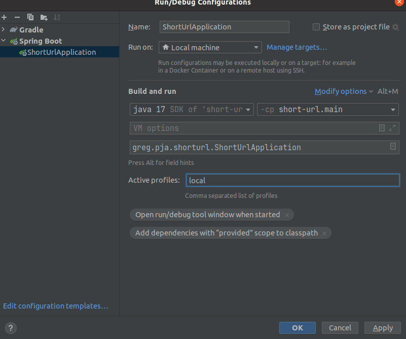

# SHORT-URL

## How to run the project

### Requirements

This project requires:

* docker
* dock-compose
* java17

### To run it with docker-compose & make

Just type `make start` in your terminal!

If you don't have _make_, well then you need:

* `docker-compose up -d db`
* `./gradlew flywayMigrate`
* `./gradlew generateJooq`
* `./gradlew bootJar`
* `docker-compose up short-url`

### To run it with your IDE & make

Just type `make init` in your terminal!

Then run spring with the `local` profile



Or type `./gradlew bootRun --args='--spring.profiles.active=local'`

### Other commands

* Run the DB with docker-compose:
    * `make db-up`
    * there's a sleep because for some reason I can't make flyway retry connecting while the DB is spinning up
* Apply migrations to DB
    * `make migrate`
* Generate jooq's classes
    * `make jooq`
* Stop everything
    * `make down`

### Troubleshooting

This project requires Java17 to run, in case the `make init` (or `make migrate`) command is not working for you and you
see an error like this:

    Incompatible because this component declares a component compatible with Java 17 and the consumer needed a component compatible with Java 11

It means your terminal's java version is 11 (or lower). You can temporarily fix your Java version by typing:

```bash
export JAVA_HOME="PATH TO YOUR JAVA 17"
export PATH=$PATH:$JAVA_HOME
```

Otherwise, use your IDE's functionality to run gradle's tasks

# The Challenge

I don't want to kill you with a wall of text. So:

## What needs to be fast?

The endpoint to retrieve the url given the short version needs to be as fast as possible.

It's ok that the generation is "slow"

## Why MD5?

As shortening a URL is not a security concern it's ok to use MD5 as hashing algorithm

## Why Postgres?

I know Postgres better, but the Repository layer is designed in a way that can be switched quite easily. Overall this is
meant to be an MVP, hence, you use what you know better, then you iterate

## How do make the url short?

I generate the MD5 hash of a URL, and then I take the first N characters. I try to save them into the DB, if it fails, I
take the N+1 characters.

If there are still collisions I will continue as long as the hash or as long as I configured. (I put 9 as default
in `application.yml`)

## How do I avoid collisions?

Well, I kind of don't. Or better: I have way more possible permutations as the length of the short URL is not fixed, but
variable.

## What is missing at the moment?

### A cronjob to remove unused short URL.

I would have probably chosen Quartz to do manage cronjobs and added a configuration to determine when a short URL is _
expired_

* The cronjob would fetch and delete all the short url which are:
    * `last_access + configurable-time-span < now`
    * `last_access is null && created_at + configurable-time-span < now`

### A nice validator for URLs

As at the moment the body of the POST request is a pure String.

## What is my definition of Production Ready?

Tested code, easy monitoring. Especially in Banking, having access to logging (or even worst to DB) can be tricky.

The code should be super robust and give an idea if it's working fine (at least for MVPs)
